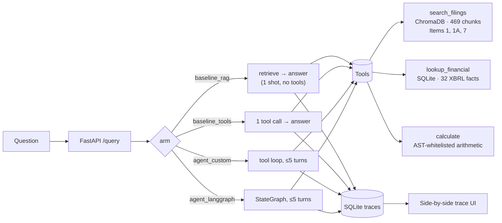

# FilingAgent

**Does an agent that can take several tool-calling turns actually beat one that
gets exactly one call?**

Most agent demos answer a different, easier question — "does it work?" — by
comparing an agent against no agent. That comparison is rigged: tools help, so
the agent wins, and you learn nothing about whether the *agency* mattered. This
project is built to answer the harder question honestly, including the
possibility that the answer is no.

It runs a controlled four-arm comparison over SEC 10-K filings, entirely on
your own machine. No API keys, no accounts, no data leaving the box.

```
429 tests · 95% coverage · 0 stubs · fully local inference
```

---

## Status

| Wave | What | State |
|---|---|---|
| 0 | Contracts, golden set, tool schemas | ✅ done |
| 1–2 | Ingest, tools, four arms, API, UI, eval harness | ✅ done |
| **3** | **The measurement run — results table** | ⏳ **not yet run** |
| 4 | Write-up, ADRs, retro | ⏳ pending |

**There is no results table in this README yet, and that is deliberate.** The
harness is built and tested, but the experiment hasn't been run. Publishing
numbers before running the run is how portfolio projects end up with results
nobody can reproduce. When Wave 3 completes, the table lands here with
confidence intervals and a paired significance test — including if the answer
is "no significant difference."

---

## The four arms

All four share one provider, one model, and one prompt. The only variable is
tool access and turn budget.

| Arm | Tools | Turns | What it isolates |
|---|---|---|---|
| `baseline_rag` | none | 1 | retrieval alone |
| `baseline_tools` | all 3 | **exactly 1** | tool *access*, without agency |
| `agent_custom` | all 3 | ≤ 5 | a hand-rolled tool loop |
| `agent_langgraph` | all 3 | ≤ 5 | the same loop, on a framework |

### Why `baseline_tools` is the whole point

Without it, "the agent beat plain RAG" only shows that tools help — true by
construction. `baseline_tools` gets the *same three tools* and exactly one
call, so the only thing separating it from `agent_custom` is the ability to
take another turn.

Here is that difference, live, on a real question:

> **"How much did Microsoft's total revenue change from FY2023 to FY2024?"**
>
> | Arm | Calls | Answer |
> |---|---|---|
> | `baseline_tools` | 1 | `{"ticker":"MSFT","metric":"revenue","fiscal_year":2024,...}` — it retrieved a *fact*, but one call can't produce a *difference* |
> | `agent_custom` | 2 | "Microsoft's total revenue increased by $33,207,000,000 from FY2023 to FY2024." |

That gap — the second lookup, then the subtraction — is the entire hypothesis.
The UI runs one question across several arms at once and puts their tool traces
side by side, so this is visible rather than asserted.

---

## Architecture



Three tools, deliberately shaped so the *choice between them* is the
interesting decision:

- **`search_filings`** — semantic search over filing prose. Has **no access to
  Item 8** (financial statements), so some numbers are simply unreachable this
  way. An agent that reaches for search when it needs an exact figure is making
  a real mistake, and the eval catches it.
- **`lookup_financial`** — exact XBRL facts. Returns **one fact per call**, so a
  two-year comparison structurally requires two calls. This is what makes
  multi-hop questions genuinely multi-hop instead of a prompt-engineering
  artifact.
- **`calculate`** — arithmetic over literals, evaluated against an AST node
  whitelist, never Python's `eval`.

Tool *descriptions* are the highest-leverage prose in the repo — the model
never sees the docstrings or this README, only those strings at decision time.
They're written to disambiguate against each other, not to explain themselves
in isolation. See `src/tool_schemas.py`.

---

## Quickstart

```bash
# 1. Install Ollama (https://ollama.com), then build the model this app expects
make model    # == ollama pull qwen3:8b && ollama create filingagent-qwen3 -f Modelfile

# 2. Build and run
docker compose up --build

# 3. Open http://localhost:8000
```

The image bakes the vector index (469 chunks), the XBRL fact table (32 rows),
and the embedding model in at build time — no ingestion step, and the container
needs no network access at all.

> No `make` on Windows? Run the two commands in the comment above directly.

### Step 1 is not optional

`make model` doesn't just pull a model — it caps the context window at 12288
tokens (see `Modelfile`). Stock `qwen3:8b` defaults to **40960** and sizes its
KV cache from that, turning a 5.2 GB model into an **11 GB** reservation. On a
6 GB card that isn't "slower" — it's a hard failure partway through a run:

```
HTTP 500: model requires more system memory (5.6 GiB) than is available (5.3 GiB)
```

Measured on an RTX 3050 6GB / 15.4 GB RAM laptop:

| Context | Reservation | On CPU | Result |
|---|---|---|---|
| 40960 (stock) | 11.0 GB | 54% | 500 error under load |
| **12288 (`make model`)** | **7.2 GB** | **26%** | **13.5s per tool turn** |

The app also sets `LLM_REASONING_EFFORT=none`. qwen3 is a reasoning model: left
alone it emits a hidden thinking block before every answer — **65.1s vs 5.0s**
on an identical question, ~13× on *every turn of every arm*. It's applied
identically to all four arms, so the comparison between them is unaffected;
only absolute wall-clock changes.

### Model choice matters more than it looks

Three of the four arms are tool-calling loops, and small models get tool
*arguments* wrong even when they correctly decide to call something:

| Model | Tool call produced |
|---|---|
| `llama3.2:3b` | `{"ticker":"Microsoft","fiscal_year":"2024"}` — wrong symbol, year as string; every lookup returns a `Miss` |
| `qwen2.5-coder:7b` | emitted the call as *prose text* rather than a structured call — scores zero on every tool arm |
| `qwen3:8b` | `{"ticker":"MSFT","metric":"revenue","fiscal_year":2024}` — correct |

Use an 8B-class model with native tool calling, or the tool arms fail for
reasons that have nothing to do with their design.

---

## Evaluation

**25 questions, hand-written by a human before any code existed.** That
ordering is what makes the numbers mean anything — a golden set written after
the fact tends to describe what the system already does.

| Tier | n | Job |
|---|---|---|
| `single_hop` | 10 | Can plain RAG already do it? Catches the agent **regressing** on easy questions |
| `numeric` | 8 | Does exact lookup beat text search for figures? |
| `multi_hop` | **4** | **The actual claim** |
| `unanswerable` | 3 | Does it refuse, or confidently invent? |

Only 4 questions test the headline claim. The other 21 are controls, and
they're what stop the result from being junk: without `unanswerable`, a system
that wins by guessing looks great; without `single_hop`, you'd miss that agents
often over-tool simple questions and get *worse*.

Numeric answers are asserted **deterministically against XBRL facts**, never
judged by a model. Only prose faithfulness goes to an LLM judge. Scoring uses
McNemar's paired test with Wilson confidence intervals.

Two scoring rules that are easy to get wrong, and were:

- Multi-hop expected values are **deltas**, not endpoints.
- `recall@5` **excludes** items whose sources aren't in the indexed sections
  (denominator 19, not 25) rather than counting them as misses.

### What testing the harness found before running it

The eval harness was tested like production code — 117 tests taking it from 0%
to ~99% coverage — *before* being used to produce results. That caught three
bugs that would each have published a wrong number:

1. **Multi-hop extraction returned the *largest* dollar figure near a
   change-keyword rather than the *nearest*.** Against the golden set's own
   phrasing ("increased $33.2 billion … from $211,915,000,000") the endpoint is
   larger — so 3 of 4 multi-hop items extracted an endpoint and the tier scored
   **1/4** instead of 4/4. That would have flattened the headline claim into a
   tie and looked exactly like a genuine null result.
2. **Unjudged items scored as failures** rather than being excluded — would
   have published `single_hop 0/10`.
3. **Rate and count denominators disagreed** — `"50% (2/10)"`.

A test suite that only covers the system under test, and not the thing
measuring it, can hand you a confident wrong answer. This is the part of the
project I'd point at first.

---

## Corpus

Apple and Microsoft 10-Ks, FY2023 and FY2024 — Items 1, 1A, and 7. Filings are
committed under `data/raw/`; nothing is scraped at build time, so the corpus is
frozen and the run is reproducible.

---

## Limitations

Stated up front, because a portfolio project that hides these is worse than one
that doesn't have them:

- **n=25 total, n=4 on the headline tier.** This will not reach statistical
  significance. The output is a directional result with honest confidence
  intervals, not a proof.
- **Two companies, two fiscal years.** Nothing here generalizes to a corpus
  with different filing conventions.
- **A local 8B model caps absolute scores.** The comparison between arms stays
  valid — they all share the model — but no arm's absolute number is a
  statement about what's achievable.
- **The LLM judge is a measurement instrument with error.** Judge-reliability
  checks (determinism replay, cross-model agreement, adversarial fixtures) are
  part of Wave 3, not yet done.
- **`agent_langgraph` is a portability check, not a fair framework benchmark.**
  It reimplements the same loop; it isn't tuned to LangGraph's strengths.

---

## Development

```bash
pip install -r requirements.txt
cp .env.example .env      # defaults to local Ollama; no key needed
make ingest               # populate the vector store and fact table
make serve                # http://localhost:8000
make test                 # 429 tests
make lint
```

Coverage is 95% across 1,448 statements. `make eval` replays recorded judge
fixtures — deterministic, no live calls, and what CI runs. `make eval-live` is
the real measurement run.

To use a hosted provider instead of local inference, set `LLM_PROVIDER` and
that provider's key in `.env`. `src/llm.py` is table-driven and supports
Ollama, Groq, Gemini, Cerebras, Z.AI, and Anthropic — adding another is a table
entry, not a branch.

**Why local is the default:** every hosted free tier was measured against this
workload and none could serve it. Groq caps at 8K tokens *per minute* and a
single RAG request 413s. Gemini's free tier allows 20 requests *per day*
against a run that needs ~400. Cerebras returned 402. Local inference on a
consumer GPU is not a compromise here — it's the only configuration that
actually runs the experiment.

---

## License

MIT
